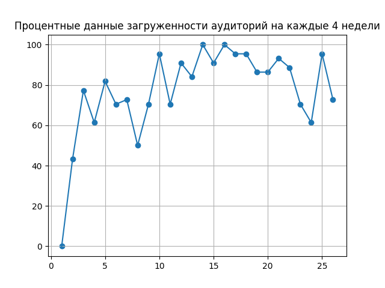

# Система по созданию умного расписания для учебного центра Пулково | Pulkovo.Hack

**Приветствие**

Здравствуйте, уважаемые коллеги. Наша команда Starting Knodel реализовала десктопную программу, решающую задачу по составлению расписания.

[***Реализация***](https://github.com/stacy-eliz/task-solve#реализация)

[***Визуализация***](https://github.com/stacy-eliz/task-solve#визуализация)

[***How to use***](https://github.com/stacy-eliz/task-solve#howtouse)

[***Заключение***](https://github.com/DmitryIo/animebot#заключение)

# Реализация

**Парсинг**

Мы распарсили исходные таблички с данными и заполнили информацию для соответствующих классов `Teacher`, `ClassRoom`, `Schedule`, `Program`. 

Весь процесс парсинга с комментариями представлен в **[`parser1.py`](https://github.com/stacy-eliz/task-solve/blob/master/parser1.py), [`reading_teachers.py`](https://github.com/stacy-eliz/task-solve/blob/master/reading_teachers.py), [`parser2.py`](https://github.com/stacy-eliz/task-solve/blob/master/parser2.py)**.

**Классы**

Для решения поставленной задачи, мы прибегли к использованию парадигм ООП и реализовали объектно-ориентированную структуру.

Все классы, их атрибуты, конструкторы и функции подробно описаны в комментариях.

Файл **[`classes.py`](https://github.com/stacy-eliz/task-solve/blob/master/classes.py)**

**Генератор**

Для создания расписания мы написали генератор, который учитывает все исходные ограничения, и выдает на выходе список с расставленными программами, преподами, аудиториями и т.д.

Он находится в соответствующем файле **[`generator.py`](https://github.com/stacy-eliz/task-solve/blob/master/generator.py)**. Сначала происходит итерация по неделям, затем по программам, а потом по преподавателям. 

Полная информация по коду указана в комментариях.

# Визуализация

Мы проанализировали полученную информацию и получили следующие виды распределения заполнения аудиторий:

По оси X представлен номер недели, по оси Y процент занятости.

А так же 

График загруженности преподавателей по неделям. По оси X - номер недели, по оси Y - кол-во пар.

# How to use

Для того чтобы запустить десктопное приложение, необходимо запустить файл **[`graph.py`](https://github.com/stacy-eliz/task-solve/blob/master/graph.py)**

Интерфейс выглядит следующим образом:

Чтобы увидеть графическое представление анализа данных на основе составленного расписания, нажмите на одну из четырех кнопок. Каждая из них подписана в соответствии с графиком.

При запуске программы **[`generator.py`](https://github.com/stacy-eliz/task-solve/blob/master/generator.py)** в файле **output.xlsx** появится распределение комнат по расписанию.

***До:***

***После:***

При запуске **[`save_xls.py`](https://github.com/stacy-eliz/task-solve/blob/master/save_xls.py)** изменяется файл **`output.xlsx`** таким образом, что в него добавляются преподаватели в соответствии со своими параметрами и годовым расписанием.

# Заключение

`ya`
